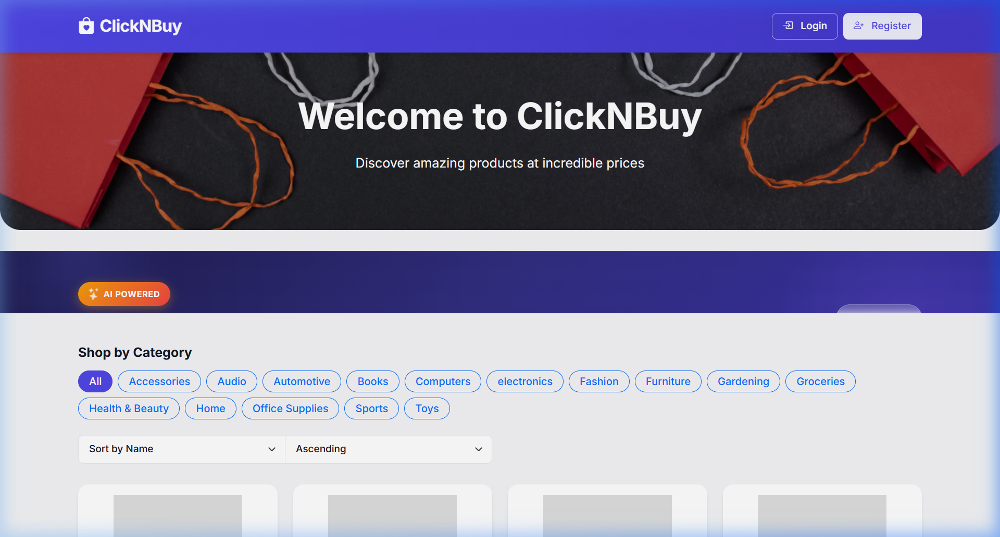
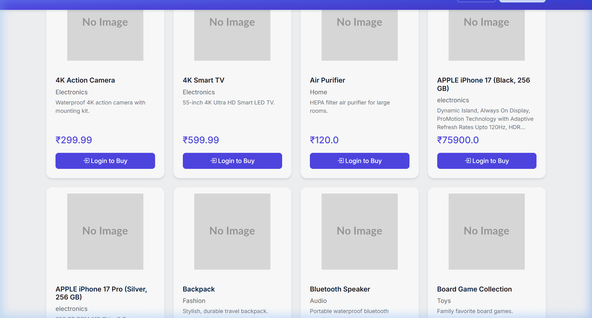
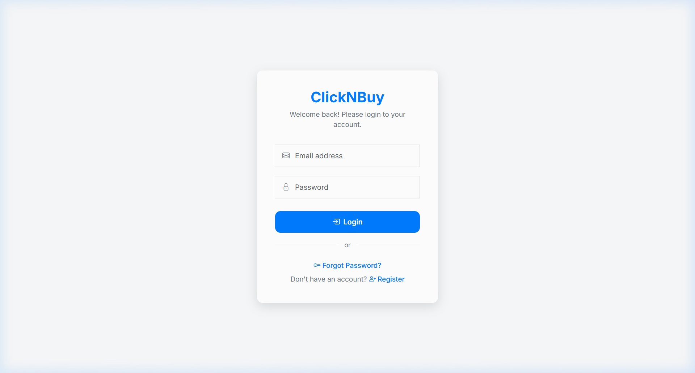
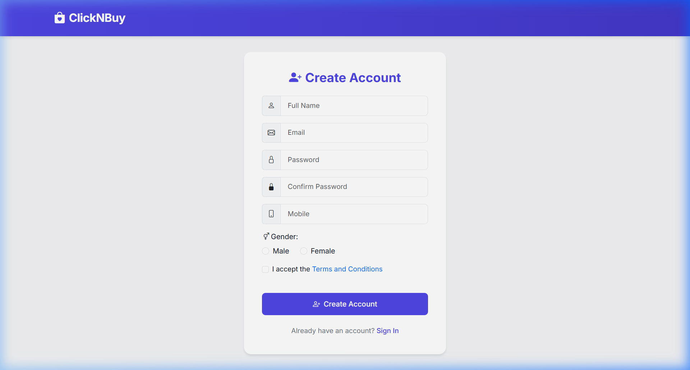

# ClickNBuy — Comprehensive Project Report

> **Full-Stack E-Commerce Web Application**  
> Built with Spring Boot 3.5, Thymeleaf, Spring Security, WebSocket, and MySQL

---

## 1. Project Overview

**ClickNBuy** is a feature-rich, production-grade e-commerce web application that enables users to browse products, manage shopping carts, place orders with Razorpay payment integration, and receive real-time notifications. It includes an admin dashboard for product and order management, an AI-powered product recommendation engine, and a modern responsive UI.

| Attribute | Detail |
|---|---|
| **Project Name** | ClickNBuy |
| **Group ID** | `com.m15` |
| **Artifact ID** | `ClickNBuy` |
| **Version** | 1.0 |
| **Java Version** | 17 |
| **Framework** | Spring Boot 3.5.7 |
| **Template Engine** | Thymeleaf |
| **Database** | MySQL (via JPA/Hibernate) |
| **Build Tool** | Maven (with wrapper) |
| **Total Source Files** | 55 |
| **Java Classes** | 37 |
| **HTML Templates** | 15 |

---

## 2. Application Screenshots

### 2.1 Home Page


The home page features a gradient navbar with the ClickNBuy brand, a hero banner with a background image, an AI-Powered recommendations section, category filter pills (15 categories), sort controls (by name/price/category), and a responsive 4-column product grid.

### 2.2 Today's Exclusive Offer Modal


A promotional popup that automatically appears on first visit with a gradient header, 50% discount banner, and "Shop Now" call-to-action. Session-controlled to show only once per visit.

### 2.3 Product Catalog Grid


Products displayed in responsive cards showing name, category, description (truncated to 3 lines), price in INR, and contextual action buttons — "Login to Buy" for anonymous users, "Add to Cart" for authenticated users, and "Edit/Delete" for admins.

### 2.4 Login Page


A clean, centered card design with email/password fields, login button, forgot password link, and registration redirect.

### 2.5 Registration Page


Full registration form with name, email, password, confirm password, mobile number, gender selection, terms acceptance checkbox, and validation.

---

## 3. Technology Stack

### 3.1 Backend Technologies

| Technology | Version | Purpose |
|---|---|---|
| Spring Boot | 3.5.7 | Application framework & auto-configuration |
| Spring Security | 6.x | Authentication, authorization, role-based access |
| Spring Data JPA | 3.5.x | Database abstraction & repository pattern |
| Spring WebSocket | 3.5.x | Real-time push notifications (STOMP/SockJS) |
| Spring Mail | 3.5.x | Email OTP delivery (Gmail SMTP) |
| Hibernate | 6.x | ORM with auto DDL generation |
| MySQL | 8.x | Relational database |
| Razorpay Java SDK | 1.4.3 | Payment gateway integration |
| Twilio SDK | 8.10.0 | SMS OTP delivery |
| Cloudinary | 2.0.0 | Cloud image hosting |
| Lombok | Latest | Boilerplate code reduction |
| Jakarta Bean Validation | 3.x | Input validation |

### 3.2 Frontend Technologies

| Technology | Version | Purpose |
|---|---|---|
| Thymeleaf | 3.x | Server-side HTML templating |
| Thymeleaf Extras Spring Security 6 | Latest | Security-aware UI rendering (sec:authorize) |
| Bootstrap | 5.3.2 | Responsive CSS framework |
| Bootstrap Icons | 1.10.5 | Icon library |
| Google Fonts (Inter) | Latest | Premium typography |
| SockJS Client | 1.x | WebSocket fallback transport |
| STOMP.js | 2.3.3 | WebSocket messaging protocol |
| Vanilla JavaScript | ES6 | Interactive UI logic |

---

## 4. System Architecture

### 4.1 Layered Architecture

```
┌─────────────────────────────────────────────────────────────┐
│                     CLIENT LAYER                            │
│  Browser (Thymeleaf + Bootstrap + JS + SockJS/STOMP)        │
└───────────────────────────┬─────────────────────────────────┘
                            │ HTTP / WebSocket
┌───────────────────────────▼─────────────────────────────────┐
│                   CONTROLLER LAYER                          │
│  ViewController │ UserController │ AdminController          │
│  AdminOrderController │ NotificationController (REST)       │
└───────────────────────────┬─────────────────────────────────┘
                            │
┌───────────────────────────▼─────────────────────────────────┐
│                    SERVICE LAYER                             │
│  UserService │ AdminService │ NotificationService            │
│  RecommendationService (AI Engine)                           │
└───────────────────────────┬─────────────────────────────────┘
                            │
┌───────────────────────────▼─────────────────────────────────┐
│                 DATA ACCESS LAYER                            │
│  UserRepository │ ProductRepository │ CartItemRepository     │
│  OrderRepository │ OrderItemRepository │ NotificationRepo    │
└───────────────────────────┬─────────────────────────────────┘
                            │
┌───────────────────────────▼─────────────────────────────────┐
│                   DATABASE LAYER                             │
│                    MySQL 8.x                                 │
│  Tables: user, product, cart_item, orders,                   │
│          order_item, notifications                           │
└─────────────────────────────────────────────────────────────┘

┌─────────────────────────────────────────────────────────────┐
│                 EXTERNAL SERVICES                            │
│  Razorpay API │ Gmail SMTP │ Twilio SMS │ Cloudinary CDN     │
└─────────────────────────────────────────────────────────────┘
```

### 4.2 Package Structure

```
com.m15.clicknbuy/
├── ClickNBuyApplication.java          # Main entry point (@SpringBootApplication)
│
├── config/
│   ├── MySecurityConfiguration.java   # Spring Security filter chain & BCrypt
│   ├── WebMvcConfig.java              # Static resource handling (/uploads)
│   ├── WebSocketConfig.java           # STOMP/SockJS WebSocket configuration
│   └── SetupDataLoader.java           # Initial sample data seeder
│
├── controller/
│   ├── ViewController.java            # Page routing (home, login, register, etc.)
│   ├── UserController.java            # User actions (cart, checkout, orders)
│   ├── AdminController.java           # Product CRUD operations
│   ├── AdminOrderController.java      # Order management + status updates
│   └── NotificationController.java    # REST API for notifications
│
├── dao/
│   └── UserDao.java                   # User data access abstraction
│
├── dto/
│   ├── UserDto.java                   # Registration form validation
│   ├── ProductDto.java                # Product creation form validation
│   └── PasswordDto.java               # Password reset form validation
│
├── entity/
│   ├── User.java                      # User account entity
│   ├── Product.java                   # Product catalog entity
│   ├── CartItem.java                  # Shopping cart entry entity
│   ├── Order.java                     # Placed order entity
│   ├── OrderItem.java                 # Line item within an order
│   └── Notification.java             # Real-time notification entity
│
├── repository/
│   ├── UserRepository.java            # User queries
│   ├── ProductRepository.java         # Product queries (category, search)
│   ├── CartItemRepository.java        # Cart queries
│   ├── OrderRepository.java           # Order queries
│   ├── OrderItemRepository.java       # Order item + popularity queries
│   └── NotificationRepository.java    # Notification queries + bulk update
│
├── security/
│   ├── CustomUserDetailService.java   # Loads user by email for authentication
│   └── CustomUserDetails.java         # Spring Security UserDetails adapter
│
├── service/
│   ├── UserService.java               # User service interface
│   ├── AdminService.java              # Admin service interface
│   ├── NotificationService.java       # Notification service interface
│   ├── RecommendationService.java     # AI recommendation engine (concrete)
│   └── impl/
│       ├── UserServiceImpl.java       # Full user business logic (425+ lines)
│       ├── AdminServiceImpl.java      # Product management logic
│       └── NotificationServiceImpl.java # WebSocket push + persistence
│
└── util/
    ├── CloudinaryHelper.java          # Image upload to Cloudinary/local
    └── OtpSender.java                 # Email + SMS OTP sender utility
```

---

## 5. Database Design

### 5.1 Entity-Relationship Diagram

```
┌──────────────┐       ┌──────────────┐       ┌──────────────┐
│     USER     │       │   PRODUCT    │       │ NOTIFICATION │
├──────────────┤       ├──────────────┤       ├──────────────┤
│ id       PK  │       │ id       PK  │       │ id       PK  │
│ name         │       │ name         │       │ title        │
│ email    UK  │       │ price        │       │ message      │
│ password     │       │ stock        │       │ type         │
│ mobile   UK  │       │ description  │       │ is_read      │
│ gender       │       │ imageLink    │       │ orderId      │
│ otp          │       │ category     │       │ createdAt    │
│ verified     │       │ createdTime  │       │ user_id  FK  │
│ role         │       └──────┬───────┘       └──────────────┘
│ createdTime  │              │
└──────┬───────┘              │
       │                      │
       │  ┌───────────────┐   │
       ├──┤  CART_ITEM    ├───┘
       │  ├───────────────┤
       │  │ id        PK  │
       │  │ quantity       │
       │  │ user_id   FK  │
       │  │ product_id FK │
       │  └───────────────┘
       │
       │  ┌───────────────┐       ┌───────────────┐
       └──┤    ORDERS     ├───────┤  ORDER_ITEM   │
          ├───────────────┤       ├───────────────┤
          │ id        PK  │       │ id        PK  │
          │ razorpayOrdId │       │ quantity       │
          │ razorpayPayId │       │ price          │
          │ razorpaySig   │       │ order_id  FK   │
          │ totalAmount   │       │ product_id FK  │
          │ deliveryAddr  │       └───────────────┘
          │ orderDate     │
          │ status        │
          │ expectedDeliv │
          │ trackingNum   │
          │ user_id   FK  │
          └───────────────┘
```

### 5.2 Table Descriptions

| Table | Records | Description |
|---|---|---|
| `user` | Users | Stores registered users with roles (USER/ADMIN), OTP, and verification status |
| `product` | Products | Product catalog with name, price, stock, description, image, and category |
| `cart_item` | Cart entries | Maps users to products with quantities (temporary before order) |
| `orders` | Orders | Completed orders with Razorpay payment details, address, tracking, and status |
| `order_item` | Order lines | Individual products within an order (price snapshot at order time) |
| `notifications` | Notifications | Real-time notifications with type, read status, and optional order link |

---

## 6. Feature Modules (Detailed)

### 6.1 User Management & Authentication

**Registration Flow:**
1. User fills registration form (name, email, password, mobile, gender)
2. Server validates input (unique email, unique mobile, password match)
3. 6-digit OTP generated and sent via Gmail SMTP + Twilio SMS
4. User enters OTP on verification page
5. OTP validated with 5-minute expiry check
6. Account activated and user redirected to login

**Security Configuration:**
- BCrypt password hashing
- Spring Security form-based login (email as username)
- Role-based URL authorization (`ROLE_USER`, `ROLE_ADMIN`)
- Session management via `HttpSession`

### 6.2 Product Catalog & Management

**User Features:**
- Browse paginated product grid (12 items/page, configurable)
- Filter by 15 categories via dynamic pill buttons
- Sort by name, price, or category (ascending/descending)
- View product details (name, category, description, price, stock status)

**Admin Features:**
- Add new products with image upload and validation
- Edit existing products (name, price, stock, description, category, image)
- Delete products
- Product name uniqueness validation

### 6.3 Shopping Cart System

- Add products to cart with automatic stock decrement
- Increase/decrease item quantities
- Real-time stock validation on each operation
- Automatic item removal when quantity reaches zero
- Cart total calculation with 2-decimal precision
- Cart persistence in database (survives browser close)

### 6.4 Order & Payment System

**Checkout Flow:**
1. User views cart → clicks "Checkout"
2. Razorpay order created (or mock order for testing)
3. User enters delivery address
4. Razorpay payment processed (or mock payment)
5. HMAC-SHA256 signature verification
6. Order created with status `PAID`
7. Order items created from cart items (price snapshot)
8. Cart cleared
9. Real-time "Order Confirmed" notification sent via WebSocket
10. Auto-generated tracking number (`TRK` + timestamp)
11. Expected delivery set to order date + 5 days

**Admin Order Management:**
- View all orders with customer details, items, and totals
- Stats dashboard (total, paid, shipped, delivered counts)
- Update order status via dropdown: `PAID` → `SHIPPED` → `DELIVERED` / `CANCELLED`
- Each status change triggers real-time WebSocket notification to the customer

### 6.5 AI Product Recommendation Engine

**Algorithm: Hybrid Content-Based + Collaborative Filtering**

```
Score Calculation Per Product:
┌─────────────────────────────────┬─────────┐
│ Signal                          │ Weight  │
├─────────────────────────────────┼─────────┤
│ Matches purchased category      │ +3.0    │
│ Matches cart item category      │ +2.0    │
│ Order popularity (capped)       │ +0-3.0  │
│ Price within ±30% of avg spend  │ +1.0    │
└─────────────────────────────────┴─────────┘
Max possible score: 9.0
```

**Features:**
- Personalized recommendations for logged-in users
- Cold-start handling: trending products for anonymous/new users
- Exclusion of already purchased and carted products
- Diversity injection: includes popular products outside user's categories
- Horizontal scroll carousel on home page with AI badge
- Dedicated `/recommendations` page with personalized + trending sections

### 6.6 Real-Time Notifications (WebSocket)

**Architecture:**
```
Admin updates order ──► NotificationService.createAndSend()
                              │
                              ├──► Save to DB (notifications table)
                              │
                              └──► SimpMessagingTemplate
                                   .convertAndSendToUser(email, "/queue/notifications", payload)
                                         │
                                         ▼
                              User's Browser (STOMP subscription)
                                         │
                                         ├──► Toast popup animation
                                         ├──► Bell ringing animation
                                         ├──► Badge count increment
                                         └──► Panel refresh (if open)
```

**Notification Types:**
| Type | Trigger | Icon |
|---|---|---|
| `PAYMENT` | Order placed successfully | 💳 Credit card |
| `ORDER_UPDATE` | Admin changes order status | 🚚 Truck |
| `SYSTEM` | System announcements | 🔔 Bell |

**UI Components:**
- Animated notification bell in navbar (both USER and ADMIN)
- Pulsing gradient badge showing unread count (max "99+")
- Bell ringing animation on new notification
- Slide-in notification panel (right drawer) with blurred overlay
- Individual notification items with type-colored icons
- "Mark all read" bulk action
- Click-to-mark-read on individual items
- Auto-reconnect on WebSocket disconnection (5-second retry)

**REST API:**
| Endpoint | Method | Response |
|---|---|---|
| `/api/notifications` | GET | JSON array of all user notifications |
| `/api/notifications/unread-count` | GET | `{"count": N}` |
| `/api/notifications/{id}/read` | POST | `{"status": "ok"}` |
| `/api/notifications/read-all` | POST | `{"status": "ok"}` |

### 6.7 Promotional Features

- **Offers Page** (`/offers`): Dedicated page with deals and promotions
- **Deal of the Day Modal**: Auto-popup with gradient header, "50% OFF" banner, countdown badge ("Ends Tonight"), and "Shop Now" CTA. Session-controlled to appear only once per visit.

---

## 7. Security Architecture

### 7.1 URL Access Control Matrix

| URL Pattern | Access Level | Description |
|---|---|---|
| `/`, `/register`, `/otp`, `/resend-otp` | Public | Registration flow |
| `/forgot-password`, `/reset-password` | Public | Password recovery |
| `/login` | Public | Login form |
| `/offers`, `/recommendations` | Authenticated | Feature pages |
| `/ws/**` | Public | WebSocket handshake |
| `/api/notifications/**` | Authenticated | Notification REST API |
| `/user/**` | `ROLE_USER` only | Cart, checkout, orders |
| `/admin/**` | `ROLE_ADMIN` only | Product CRUD, order management |

### 7.2 Security Features
- **Password Encryption**: BCrypt with default strength
- **CSRF**: Disabled (required for Razorpay payment callbacks)
- **Session Management**: Server-side HttpSession
- **Thymeleaf Security**: `sec:authorize` directives for conditional UI rendering
- **Custom UserDetailsService**: Loads users by email, checks verified status

---

## 8. Complete API Reference

### 8.1 View Controllers (HTML responses)

| Method | Endpoint | Description |
|---|---|---|
| GET | `/` | Home page with products, categories, recommendations |
| GET | `/login` | Login page |
| GET | `/register` | Registration page |
| GET | `/otp` | OTP verification page |
| GET | `/forgot-password` | Forgot password page |
| GET | `/reset-password` | Reset password page |
| GET | `/offers` | Promotional offers page |
| GET | `/recommendations` | AI recommendations page |

### 8.2 User Endpoints

| Method | Endpoint | Description |
|---|---|---|
| POST | `/register` | Register new user account |
| POST | `/otp` | Verify OTP code |
| GET | `/resend-otp?id={id}` | Resend OTP to user |
| POST | `/forgot-password` | Initiate password reset |
| POST | `/reset-password` | Complete password reset with OTP |
| GET | `/user/add-cart/{id}` | Add product to cart |
| GET | `/user/cart` | View shopping cart |
| GET | `/user/cart/increase/{id}` | Increase cart item quantity |
| GET | `/user/cart/decrease/{id}` | Decrease cart item quantity |
| GET | `/user/checkout` | Checkout with Razorpay |
| GET | `/user/payment/success` | Payment success callback |
| GET | `/user/orders` | View order history |

### 8.3 Admin Endpoints

| Method | Endpoint | Description |
|---|---|---|
| GET | `/admin/add-product` | Add product form |
| POST | `/admin/add-product` | Create new product |
| GET | `/admin/edit/{id}` | Edit product form |
| POST | `/admin/update-product` | Update existing product |
| GET | `/admin/delete/{id}` | Delete product |
| GET | `/admin/orders` | Order management dashboard |
| POST | `/admin/orders/{id}/status` | Update order status (triggers notification) |

### 8.4 Notification REST API

| Method | Endpoint | Response | Description |
|---|---|---|---|
| GET | `/api/notifications` | JSON Array | All user notifications (newest first) |
| GET | `/api/notifications/unread-count` | `{"count": N}` | Unread notification count |
| POST | `/api/notifications/{id}/read` | `{"status":"ok"}` | Mark single notification as read |
| POST | `/api/notifications/read-all` | `{"status":"ok"}` | Mark all notifications as read |

### 8.5 WebSocket Endpoints

| Endpoint | Protocol | Direction | Description |
|---|---|---|---|
| `/ws` | SockJS/STOMP | Connect | WebSocket handshake endpoint |
| `/user/queue/notifications` | STOMP | Server → Client | User-specific notification channel |

---

## 9. Configuration Reference

```properties
# ============================================
# SERVER CONFIGURATION
# ============================================
spring.application.name=ClickNBuy
server.port=${PORT:8080}

# ============================================
# DATABASE CONFIGURATION (MySQL)
# ============================================
spring.datasource.url=jdbc:${DB_URL:mysql://localhost:3306/clicknbuy?createDatabaseIfNotExist=true}
spring.datasource.username=${DB_UN:root}
spring.datasource.password=${DB_PWD:****}
spring.jpa.hibernate.ddl-auto=update
spring.jpa.show-sql=true
spring.jpa.properties.hibernate.format_sql=true

# ============================================
# EMAIL CONFIGURATION (Gmail SMTP)
# ============================================
spring.mail.host=smtp.gmail.com
spring.mail.port=587
spring.mail.username=${EMAIL:****@gmail.com}
spring.mail.password=${APP_PWD:****}
spring.mail.properties.mail.smtp.auth=true
spring.mail.properties.mail.smtp.starttls.enable=true

# ============================================
# EXTERNAL SERVICE INTEGRATIONS
# ============================================
cloudinary.url=${CLOUDINARY_URL:your-cloudinary-url}
twilio.sid=${TWILIO_ACCOUNT_SID:your-twilio-sid}
twilio.auth.token=${TWILIO_AUTH_TOKEN:your-twilio-auth-token}
twilio.mobile=${TWILIO_MOBILE:your-twilio-mobile}
razorpay.id=${RAZORPAY_KEY_ID:your-razorpay-key-id}
razorpay.secret=${RAZORPAY_KEY_SECRET:your-razorpay-key-secret}
```

> **Note:** All sensitive values support environment variable overrides via `${ENV_VAR:default}` syntax for secure deployment.

---

## 10. How to Run

### Prerequisites
- Java 17+
- MySQL 8.x running on `localhost:3306`
- Maven (or use the included Maven wrapper)

### Steps

```bash
# 1. Clone the repository
git clone <repository-url>
cd clickNbuy-SpringBoot-Thymeleaf-master

# 2. Configure database (auto-created if not exists)
# Default: mysql://localhost:3306/clicknbuy (user: root)

# 3. Run with Maven wrapper
./mvnw spring-boot:run        # Linux/Mac
.\mvnw.cmd spring-boot:run    # Windows

# 4. Open browser
# Application: http://localhost:8080
```

### Default Accounts
- **Admin**: Automatically assigned to the configured admin email
- **Users**: Register via the registration form with OTP verification

---

## 11. Project Statistics

| Metric | Count |
|---|---|
| Total source files | 55 |
| Java classes | 37 |
| HTML templates | 15 |
| JPA entities | 6 |
| Database tables | 6 |
| Spring repositories | 6 |
| Controllers | 5 |
| Services (interface + impl) | 8 |
| DTOs | 3 |
| Configuration classes | 4 |
| Utility classes | 2 |
| Security classes | 2 |
| REST API endpoints | 4 |
| View endpoints | 8 |
| User action endpoints | 12 |
| Admin endpoints | 7 |
| WebSocket channels | 1 |
| Product categories | 15 |
| External integrations | 4 |

### External Integrations
| Service | Purpose |
|---|---|
| **Razorpay** | Payment gateway (with mock mode for testing) |
| **Gmail SMTP** | Email OTP delivery |
| **Twilio** | SMS OTP delivery |
| **Cloudinary** | Cloud image hosting |

---

## 12. Future Enhancements (Planned)

- Advanced Search & Filtering with text search, price range, and multi-category filters
- Wishlist functionality
- Order invoice PDF generation
- Admin analytics dashboard
- Product reviews and ratings
- Email notifications for order status changes

---

*Report generated on May 16, 2026*  
*ClickNBuy v1.0 — Spring Boot 3.5.7*
